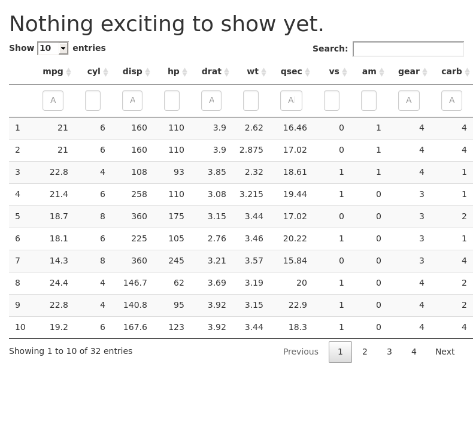

<!-- README.md is generated from README.Rmd. Please edit that file -->

# litigationRisk

<!-- badges: start -->

[](https://github.com/2DegreesInvesting/litigationRisk/actions)
[](https://codecov.io/gh/2DegreesInvesting/litigationRisk?branch=main)
<!-- badges: end -->

This repository hosts the source code of the ‘litigationRisk’ app.

## Installation

You can install the development version from
[GitHub](https://github.com/) with:

``` r
# install.packages("devtools")
devtools::install_github("2DegreesInvesting/litigationRisk")
```

## Example

``` r
installed_data <- system.file("extdata", package = "litigationRisk")
list.files(installed_data)
#> [1] "mtcars.csv"

litigationRisk::run_app()
#> Loading required package: shiny
#> 
#> Listening on http://127.0.0.1:5601
```


